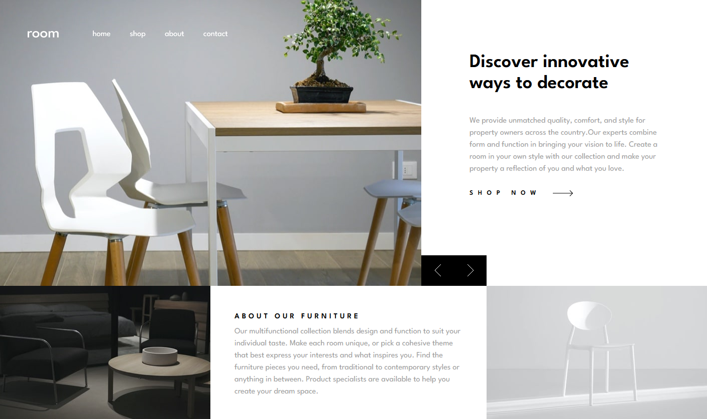
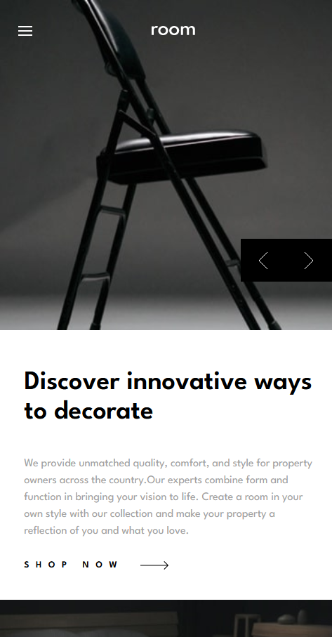

# nk_furniture_website

This project is a simple home page for a furniture e-commerce website, it has a mobile version of it and a desktop version.

## Installation

  - cd nk_furniture_website
  - npm i 
  - npm i axios
  - npm i react-router-dom
  - cd back/
  - npm i express

## Running

### First terminal
  
  npm run dev

### Second terminal

  - cd/back
  - npm run start:back
  

## Languages and tools used

This project tis made with
  - express
  - vite
  - react
  - js

## Render

## Credits

Exercice and figma are available on the frontend mentor website which help you to improve your front skills with simple exercices.
